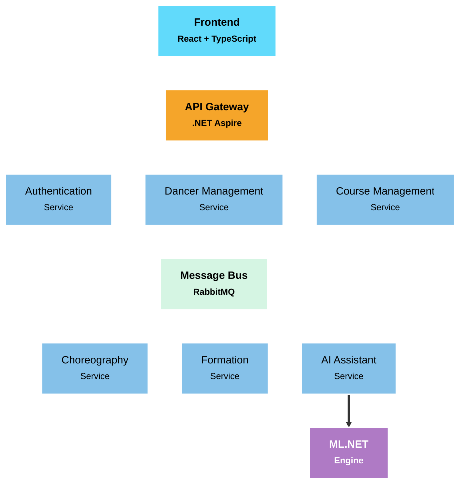

# 💃 Dance Choreography Manager 🕺

[](https://opensource.org/licenses/MIT)
[](https://learn.microsoft.com/en-us/dotnet/aspire/get-started/aspire-overview)
[](https://reactjs.org/)
[](https://www.typescriptlang.org/)
[](https://www.postgresql.org/)
[](https://www.docker.com/)
[](https://dotnet.microsoft.com/apps/machinelearning-ai/ml-dotnet)
[]()

## Table of Contents
- [Overview](#-overview)
- [Key Features](#-key-features)
- [Project Status](#-project-status)
- [Quick Start Guide](#-quick-start-guide)
- [Common Use Cases](#-common-use-cases)
- [Architecture](#architecture)
- [Technical Stack](#technical-stack)
- [Development](#-development)
  - [Prerequisites](#prerequisites)
  - [Installation](#installation)
  - [Test Procedures](#test-procedures)
- [Services Overview](#-services-overview)
- [Troubleshooting](#-troubleshooting)
- [Technologies Used](#technologies-used)
- [Contributing](#-contributing)
- [License](#-license)
- [Contact](#-contact)

## 📋 Overview

Dance Choreography Manager is a comprehensive application designed to help dance teachers create, manage, and visualize choreographies, dancers, and formations. Built with a modern microservices architecture, this tool brings together the power of AI assistance and intuitive visual design to revolutionize the dance choreography process.

> **Note:** Application screenshots will be added as the interface is finalized.

## ✨ Key Features

- 👤 **Comprehensive Dancer Management** - Track profiles, attributes, and performance metrics
- 🎭 **Visual Formation Editor** - Intuitive drag-and-drop interface for designing formations
- 🔄 **Transition Animations** - Visualize movement between formations with smooth animations
- 🧠 **AI-Powered Recommendations** - Get intelligent position suggestions based on dancer attributes
- ⚖️ **Attribute-Based Balancing** - Automatically balance formations considering gender and physical attributes
- 📚 **Formation History** - Track changes and evolution of choreographies over time
- 🔧 **Customizable Constraints** - Define your own rules for formation generation and validation
- 📱 **Responsive Interface** - Access your choreographies on any device

## 📈 Project Status

The project is currently in active development (Alpha v0.0.1).

### Current Development Phase
- **Alpha Stage**: Core functionality is being implemented with regular updates.
- **Expected Beta Release**: Q2 2025

### Feature Status
| Feature | Status | Estimated Completion |
|---------|--------|----------------------|
| User Authentication | 🚧 In Progress | April 2025 |
| Dancer Profiles | 🚧 In Progress | April 2025 |
| Basic Formation Editor | ✅ Complete | May 2025 |
| Course Management | 🚧 In Progress | May 2025 |
| AI Recommendations | 🚧 In Progress | June 2025 |
| Transition Animations | 📅 Planned | July 2025 |
| Mobile Responsiveness | 📅 Planned | August 2025 |

### Known Limitations
- AI recommendation engine requires at least 10 dancers to provide meaningful suggestions
- Large choreographies (50+ dancers) may experience performance issues in the formation editor
- Only supports English language currently

View our full [project roadmap](ROADMAP.md) for detailed information on development phases and progress.

## 🚀 Quick Start Guide

### For Dance Instructors

1. **Create a new choreography**
   - Navigate to "My Choreographies" and click "Create New"
   - Add basic details (name, style, duration)
   
2. **Add dancers**
   - Go to "Dancers" and click "Add New" or import from a CSV file
   - Assign attributes (height, experience level, etc.)
   
3. **Design formations**
   - Open your choreography and click "Add Formation"
   - Drag dancers onto the stage or use "Auto-arrange" for quick positioning
   
4. **Preview transitions**
   - Click "Preview" to see animated transitions between formations
   - Adjust timing using the timeline editor

<!-- TODO: Add a screenshot of the formation editor interface here when available -->
> **Note:** Screenshots of the formation editor interface will be added once the UI is finalized.

## 💡 Common Use Cases

### Dance Competition Preparation
Organize complex formations for competitive dance teams with precision timing and positioning.

```
Example workflow:
1. Create a new "Competition" choreography
2. Import your team roster
3. Design 5-7 key formations
4. Set transition timing to match music
5. Export and share with your team
```

### Dance Education
Create clear visual guides for students to understand positioning and movement patterns.

```
Example workflow:
1. Create a "Beginner Ballet" choreography
2. Add generic dancer profiles
3. Use different colors to indicate dancer groups
4. Export PDF handouts for students
```

<!-- TODO: Add a screenshot of an example choreography here when available -->
> **Note:** Example choreography screenshots will be added as the application development progresses.

## Architecture

Dance Choreography Manager implements a modern microservices architecture built on .NET Aspire, designed for scalability, resilience, and maintainability.

### 🔄 System Overview

The architecture follows domain-driven design principles with bounded contexts represented as independent microservices. Each service maintains its own data store and communicates with other services through an event-driven messaging system.

### System Architecture Diagram



### 🔗 Communication Patterns

The architecture implements two primary communication patterns:

1. **Synchronous Communication**: REST APIs for direct client-to-service interactions through the API Gateway
2. **Asynchronous Communication**: Event-driven messaging via RabbitMQ for inter-service communication

This hybrid approach ensures responsive user experiences while maintaining service independence and resilience.

## Technical Stack

- **Frontend**: React 18+ with TypeScript and Tailwind CSS
- **Backend**: .NET 8 Aspire for cloud-native service orchestration
- **Data**: PostgreSQL databases with independent schemas per service
- **AI**: ML.NET for machine learning capabilities
- **DevOps**: Docker containerization with Kubernetes orchestration
- **Observability**: OpenTelemetry for distributed tracing and metrics
- **Security**: OAuth 2.0, JWT, and HTTPS throughout the system

## 💻 Development

### Prerequisites

- [.NET 8.0 SDK](https://dotnet.microsoft.com/download) v8.0.100 or later
- [Node.js](https://nodejs.org/) v16.14.0 or later
- [npm](https://www.npmjs.com/) v8.5.0 or later
- [Docker](https://www.docker.com/products/docker-desktop) v20.10.12 or later
- [Docker Compose](https://docs.docker.com/compose/install/) v2.2.3 or later
- [PostgreSQL](https://www.postgresql.org/download/) v14.0 or later (if running locally)

### Installation

1. Clone the repository
   ```bash
   git clone https://github.com/riccardomerenda/dance-choreography-manager.git
   cd dance-choreography-manager
   ```

2. Start the development environment
   ```bash
   docker-compose up -d
   ```

3. Build and run the .NET Aspire application
   ```bash
   cd src
   dotnet build
   dotnet run --project AppHost
   ```

4. Start the frontend application
   ```bash
   cd frontend
   npm install
   npm run dev
   ```

5. Access the application at `http://localhost:5173`

### Test Procedures

#### Running Backend Tests
```bash
cd src
dotnet test
```

#### Running Frontend Tests
```bash
cd frontend
npm test
```

#### End-to-End Testing
```bash
cd e2e-tests
npm run cypress:open
```

### Development Environment

We recommend using:
- Visual Studio 2022 or VS Code for .NET development
- VS Code with ESLint and Prettier extensions for frontend development
- Docker Desktop for container management

## 🧩 Services Overview

| Service | Description | Key Capabilities | Status |
|:--------|:------------|:-----------------|:-------|
| **Authentication Service** | Handles user identity and security | JWT authentication, role-based authorization, OAuth integration | 🚧 In Progress |
| **Dancer Management Service** | Manages dancer profiles and data | Dancer profiles with attributes, skill assessment, grouping | 🚧 In Progress |
| **Course Management Service** | Organizes dance classes and programs | Scheduling, attendance tracking, curriculum management | 🚧 In Progress |
| **Choreography Service** | Manages creative choreography content | Music synchronization, movement cataloging, choreography versioning | 🚧 In Progress |
| **Formation Management Service** | Controls spatial arrangements | Position mapping, transition animation, formation optimization | 🚧 In Progress |
| **AI Assistant Service** | Provides intelligent recommendations | Formation suggestions, optimal positioning, pattern recognition | 📅 Planned |

## ❓ Troubleshooting

### Common Issues

#### Application fails to start
- Ensure all Docker containers are running: `docker ps`
- Check PostgreSQL connection string in `appsettings.json`
- Verify RabbitMQ is accessible at the configured host/port

#### Formation editor performance issues
- Limit the number of dancers to 50 per formation for optimal performance
- Disable transition animations when designing complex formations
- Use Chrome or Edge browsers for best performance

#### Database connection errors
- Check that PostgreSQL service is running
- Verify database credentials in configuration
- Ensure database schema migrations have been applied

## Technologies Used

- **.NET Aspire** - Cloud-ready stack for building observable, production-ready distributed applications
- **React** - Frontend JavaScript library for building user interfaces
- **TypeScript** - Strongly typed programming language for JavaScript
- **Tailwind CSS** - Utility-first CSS framework
- **PostgreSQL** - Advanced open-source relational database
- **Docker** - Containerization platform
- **RabbitMQ** - Message broker for service communication
- **ML.NET** - Machine learning framework for .NET

## 👥 Contributing

Contributions are welcome! Please follow these steps to contribute:

1. Fork the project
2. Create your feature branch (`git checkout -b feature/AmazingFeature`)
3. Make your changes
4. Run the tests (`dotnet test` and `npm test`)
5. Commit your changes (`git commit -m 'Add some AmazingFeature'`)
6. Push to the branch (`git push origin feature/AmazingFeature`)
7. Open a Pull Request

### Contribution Standards

- Follow the existing code style (EditorConfig is included in the repo)
- Write unit tests for new features
- Keep PRs focused on a single feature or bug fix
- Update documentation for significant changes
- Add comments for complex logic

## 📝 License

This project is licensed under the MIT License - see the [LICENSE](LICENSE) file for details.

## 📞 Contact

Project Website: (Coming Soon)
GitHub Repository: [github.com/riccardomerenda/dance-choreography-manager](https://github.com/riccardomerenda/dance-choreography-manager)
Email: [riccardomerenda@gmail.com](mailto:riccardomerenda@gmail.com)

---

<p align="center">Made with ❤️ for dancers and choreographers everywhere</p># 💃 Dance Choreography Manager 🕺
